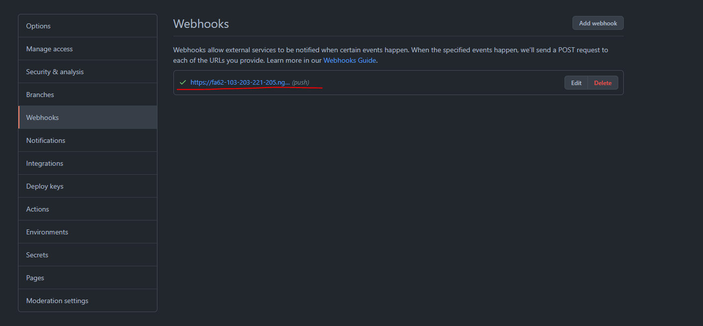

# Example for Github Integration

This example is built based on `main` branch and intend to show basic integration with Github Webhooks. Therefore this instruction will only show what changes have been done to adapt to Github webhook rules.

Note: This example only demonstrates commit action notification subscription for a pre-defined Github repository. Some implementations are intentionally done for the sake of simplicity.

# Try Example

This instruction assumes that you have already read the [framework instruction](/README.md).

## Step.1 Github Registration

Register an app on Github following [Instruction](https://docs.github.com/en/rest/guides/basics-of-authentication#registering-your-app).

During the setup, let's fill `Authorization callback URL` with `https://xxxxxxxx.ngrok.io/oauth-callback` (or go with a temporary one and update it after we do `npm run ngrok` and get our real server address). `Homepage URL` isn't important, you can fill in a dummy url.

Note: `Authorization callback URL` is the auth-callback endpoint on our server. It is registered under your Github app for creating a callback carrying access code (NOT access token.) to our server when user authorization is finished. The access code will then be exchanged for access token.

Do `cp .env.sample .env`

After the setup, we'll get `Client ID` and `Client Secret`. Let's copy them over to `.env` on `GITHUB_CLIENT_ID` and `GITHUB_CLIENT_SECRET`.

## Step.2 Local Setup

- `npm run initDB`
- `npm run ngrok` and copy `https://xxxxxxxx.ngrok.io` to `APP_SERVER` in `.env`, and fill `Authorization callback URL` with `https://xxxxxxxx.ngrok.io/oauth-callback`. Pick a repository you want to subscribe and copy its name (ONLY plain repo name, don't include user path) to `TEST_REPO_NAME` in `.env`.
- Open a new terminal and `npm run start`
- Open another new terminal and `npm run client`

## Step.3 Use Developer Tool

- Go to [Developer Tool](https://ringcentral.github.io/ringcentral-notification-app-developer-tool/), fill in relevant info and do auth (details in [Framework Readme](README.md#step3-mock-subscription)). Note: the auth step will automatically create a subscription for `push` events under your repository.
- Go to your repository's Settings page and check if there's a webhook created.
- Push a commit to your Github repository and there should be a message sent to your RingCentral App channel.
- Logout and do another push, there should be no message sent to your RingCentral App channel.

# Understand Changes

Let's have a look at what I have changed to implement the basic integration with Github webhooks. It's recommended that you compare this branch with `main` to have a good overall view on what's changed.

## Database - User Model

Typically, OAuth should have access_token and refresh_token for security reason. Github here only has access_token, `tokens` is replaced with `accessToken` in `src/server/db/userModel.js`. Also, `name` is added because Github locates a repository with owner's name rather than owner's id.

## Flow - Auth

1. In `src/server/routes/authorization.js`, I replaced [Mocked Flow] with [Actual Flow] and have `authUrl` as `${process.env.AUTH_URL}&client_id=${process.env.GITHUB_CLIENT_ID}` according to [Github Auth Basics](https://docs.github.com/en/rest/guides/basics-of-authentication#accepting-user-authorization)
2. Once authorized, Github returns a temporary code which we can use to exchange for access token. Two spots need to be changed:
   1. In `src/client/lib/client.js - saveUserInfo(callbackUri)`, we want `code` in `callbackUrl`.
   2. In `src/server/routes/authorization.js - saveUserInfo(req, res)`, it gets the code and call [Github API](https://docs.github.com/en/rest/guides/basics-of-authentication#providing-a-callback) to exchange for access token, then save it to database.
3. Additionally, [User API call](https://docs.github.com/en/rest/reference/users#get-the-authenticated-user) is also added to retrieve user information.

After changes above, we are able to auth user for further API calls to Github.

## Flow - Subscription

There are several types of webhook subscriptions we can do on Github. [create repository webhook](https://docs.github.com/en/rest/reference/repos#create-a-repository-webhook) is chosen here. Code changes are made in `src/server/routes/subscription.js` to follow the API rules of creating a repository webhook and save relevant information in database.

## Flow - Notification

Changes are in `src/server/routes/notification.js` and they are applied simply following [push notification payload structure](https://docs.github.com/en/developers/webhooks-and-events/webhooks/webhook-events-and-payloads#push)

## Flow - Revoke

Changes are in `src/server/routes/authorization.js` to unsubscribe from Github webhook and delete relevant database information.

# Additional Resource
- [Github Auth Scopes](https://docs.github.com/en/developers/apps/building-oauth-apps/scopes-for-oauth-apps)