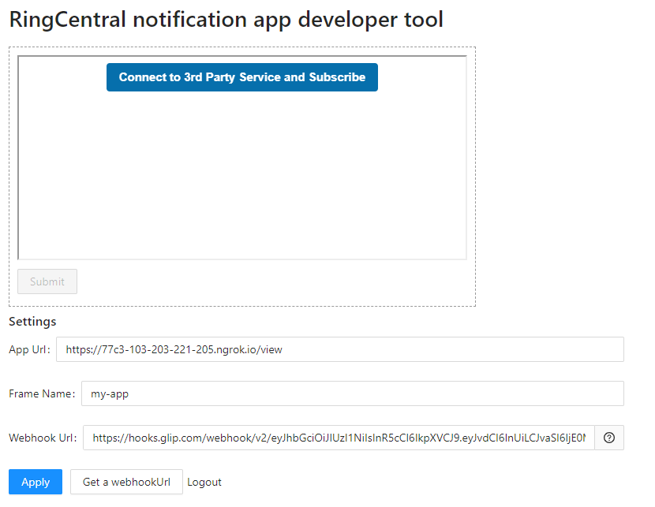
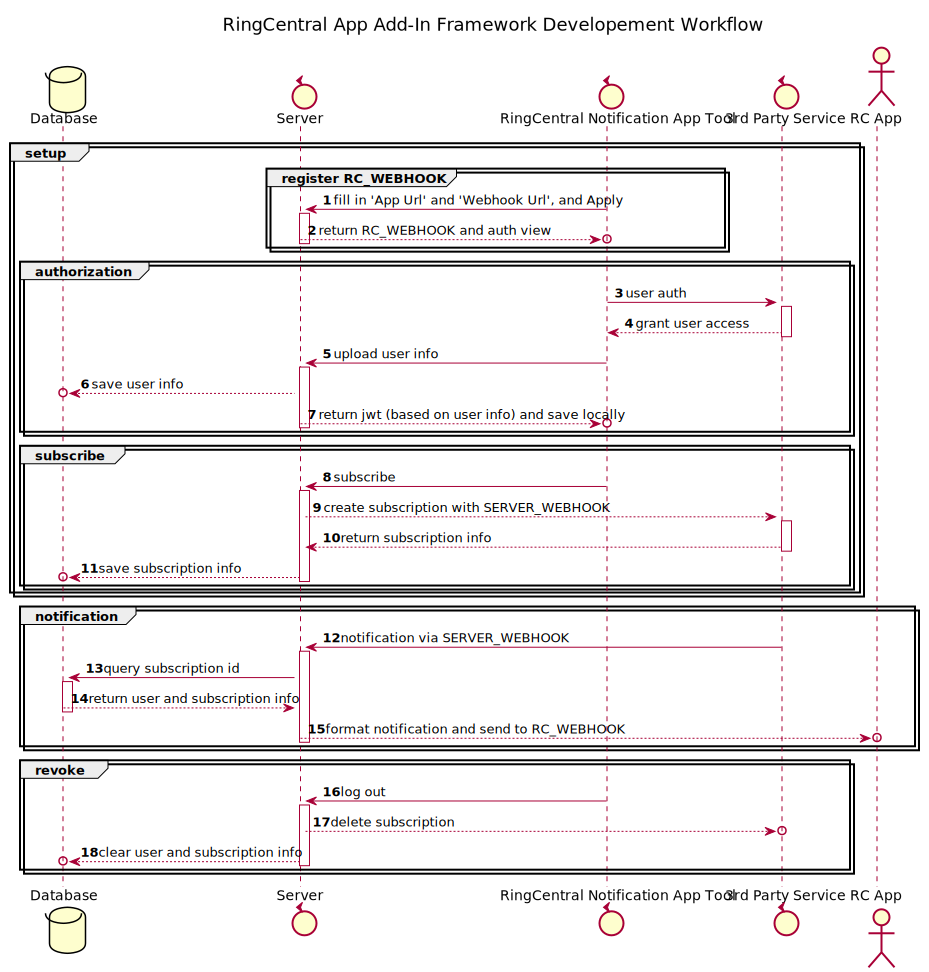

# Example Project Doc

[Example](Example.md)

# RingCentral-Add-In-Framework

The framework will help you create a RingCentral Add-In App that subscribes to 3rd party notifications via webhook and forward incoming notifications from 3rd party server to RingCentral App.

This project aims to help you quickly set up a local test environment so that you can move from there and integration 3rd party functionalities in.

# Prerequisites

- Download and install RingCentral App and login: https://www.ringcentral.com/apps/rc-app
- Nodejs and npm.

# How It Works

There are 3 major parts involved:
- Setup:
  - Get RingCentral App info
  - Auth on 3rd party and subscribe to events
- Use:
  - Process and forward 3rd party event notifications to RingCentral App via webhook
- Revoke:
  - Ubsubscribe and clear user info

# Run It

## Step.1 Start Web Tunnel

```bash
# get the code
git clone git@github.com:DaKingKong/ringcentral-add-in-framework.git
cd ringcentral-add-in-framework

# install dependecies
npm i

# start proxy server, this will allow your local bot server to be accessed by the RingCentral service
npm run ngrok

# will show
Forwarding                    https://xxxx.ngrok.io -> localhost:6066
# Remember the https://xxxx.ngrok.io, we will use it later
```

ngrok will expose your local server to a public address where you can have other services interact with it.

Note: your local firewall might block certain ngrok regions. If so, try changing `ngrok http -region us 6066` in `package.json` to [other regions](https://www.google.com/search?q=ngrok+regions).

## Step.2 Set Up Environment Info

```bash
# create env file
cp .env.sample .env

# create db file
npm run initDB
```

Copy above `https://xxxx.ngrok.io` over to APP_SERVER field in `.env` file.


```bash
# open a new terminal
# start local server
npm run start

# open another new terminal
# start client app
npm run client
```

## Step.3 Mock Subscription

For local development, we can use [RingCentral notification app developer tool](https://ringcentral.github.io/ringcentral-notification-app-developer-tool/) to simulate RingCentral App Gallery shell which handles communications between your app and RingCentral server.



To use above tool, there are two fields we want to fill in:

1. `App Url`: It is for this tool to retrieve the app's entry point to render. In our framework, it's set to `https://xxxx.ngrok.io/view`
2. `Webhook Url`, there are 2 ways:
   1. Click `Get a webhookUrl` and login to your RingCentral App. Generate webhook url from your Team channel.
   2. Go to RingCentral App Gallery and add Incoming Webhook App to your conversation channel. As a result, you will get a webhook URL like `https://hooks.glip.com/webhook/xxxxx` (aka `RC_WEBHOOK`) and that's what we need here.

Now press `Apply` ([workflow 1-2](#workflow-diagram)). We should be able to see the UI button gets rendered in top block.

Due to the fact that every platform has its slightly different way to provide webhook services, and to make this framework not targeting specific platform, there's NO actual 3rd party integration. We'll do following mock steps instead.

- `Mock Auth` ([workflow 3-7](#workflow-diagram)): Press `Connect to 3rd Party Service and Subcscribe`. It will open an auth page and immediately close it to mock a successful authorization and auth callback.
- `Mock Subscription` ([workflow 8-11](#workflow-diagram)): Upon the close of auth page, a mock subscription is automatically created (in practice, it's recommended to create a separate flow for auth and subscription). `SERVER_WEBHOOK` is our endpoint to receive subscribed event notifications. Typically, it is to be registered on 3rd party platform manually or by API calls.

## Step.4 Send Mock Messages

Now it is all set. Let's try sending some messages to our RingCentral App conversation channel.

- `Mock Message` ([workflow 12-15](#workflow-diagram)): We are playing the role of a 3rd party service here to send mock message to `SERVER_WEBHOOK`. Do a HTTP POST to `https://xxxx.ngrok.io/notification` with below payload format:
  
```json
{
    "isAdaptiveCard": true,   // false for RingCentral Card with plain message, true for Adapative Card
    "id":"sub-123456",   // do NOT change this, it's a hard-coded mock subcription id in subscription.js
    "username": "test user",
    "userEmail": "test@test.com",
    "documentName": "test.docx"
}
```

```json
headers:{
  "Content-Type" : "application/json"
}
```

## Step.5 Revoke

Press `Ubsubcribe and Logout`, and incoming notifications will not be sent to your RingCentral App conversation channel.

# Workflow Diagram



# Development

`!!!IMPORTANT!!! This framework is composed by mock actions which simulate responses from a 3rd party API server. All places with ===[MOCK]=== tag should be replaced with the actual logic that handles interactions with a real 3rd party service`

As indicated above, the worlflow isn't super complicated. In practice, the complexities are mostly from understanding how the target 3rd party designs its webhook service.

## Example

Check out `Example` branch for a basic Github integration example with additional notes on what are the changes that need to be done.

## Auth

3rd party platform would require developer to set up `auth callback url` for it to return to when auth is successful. `auth callback url` is `https://xxxxxxx.ngrok.io/oauth-callback`. More routes for other endpoints can be found in `src/server/index.js`.

Typically for OAuth with 3rd party service, the steps would be:
1. Open a new auth page with `auth url`. `auth url`'s structure should be provided by 3rd party documents. 
2. Input user credentials to authenticate and authorize. 3rd party service will return to our `auth callback url`, typically, with a code for calling another API and exchange it for an access token and a refresh token.
3. We save jwt to client side and store tokens in database for future API calls.

### Apply Changes

There are 4 places with `===[MOCK]===` tag that need to be changed, 3 in `authorization.js` and 1 in `client.js`. Note: `client.js - saveUserInfo` receives 3rd party callback uri and extract auth code, then calls server `authorization.js - saveUserInfo`.

Please read 3rd party docs and make changes accordingly. (There could also be database model changes)

### Test

After making above changes, you should test the authorization part on its own. Go to `Root.jsx` amd comment out `await client.subscribe()`. The correct behaviours should be:
1. Click `Connect to 3rd Party Service and Subscribe` and a new page is open
2. Do 3rd party auth on the new page and confirm
3. Auth page closes and return to Developer Tool which should show `Hello, xxxxx` and a `Unsubscribe and Logout` button
4. Have a look at `db.sqlite` file and examine if `users` table has relevant record

## Webhook Subscription & Notification

Typically, webhook subscription can be created by API calls to 3rd party server and the call payload would contain notification receiver endpoint on our end as `SERVER_WEBHOOK` mentioned above. 

### Apply Changes

There is 1 `===[MOCK]===` tag in `subscription.js` and another in `notification.js`. In `notification.js`, message tranformation should be done according to 3rd party notification data structure.

### Message Transform

Message tranform happens when we receive notifications and parse them into either [RingCentral Card](https://developers.ringcentral.com/guide/team-messaging/manual/posting-cards) or [Adaptive Card](https://adaptivecards.io/designer/).

### Test

Go to `Root.jsx` amd uncomment `await client.subscribe()`. The correct behaviours should be:
1. Auth and subscribe
2. Do actions that will trigger event notification
3. Receive message in RingCentral App

## More to Think

Auth:
- Some platform would have access tokens with expiry. We'll need a refresh mechanism to detect that and refresh access.

Subscription:
- Is there a filtering mechanism to subscribe to selected types of events? If so, we'll want to add UIs for configuring it.
- Does subscription messages contain all the information we want? If not, we'll want to have follow-up logic to fetch it. An example would be, Google Drive activity only has resourceId, and we want to use it to then fetch full file info with resourceId.

# Deployment

## Register App on RingCentral Developer Website

Create your app following [this guide](https://developers.ringcentral.com/guide/applications).

## Deploy with Serverless

### 1. Compile JS files

```
$ npm run client-build
```

And get all JS assets file at public folder. Upload all files in public into CDN or static web server.

### 2. Create `serverless-deploy/env.yml` file

```
$ cp serverless-deploy/env.default.yml serverless-deploy/env.yml
```

Edit `serverless-deploy/env.yml` to set environment variables.
We will get `APP_SERVER` after first deploy. So now just keep it blank.

### 3. Create `serverless-deploy/serverless.yml` file

```
$ cp serverless-deploy/serverless.default.yml serverless-deploy/serverless.yml
```

Edit `serverless-deploy/env.yml` to update serverless settings.
The Dynamo `TableName` should be `${DYNAMODB_TABLE_PREFIX}webhooks`. `DYNAMODB_TABLE_PREFIX` is environment variable that we set upper. `ASSETS_PATH` is uri where you host JS files in `Step 1`.

### 4. Deploy

```
$ npm run serverless-build
$ npm run serverless-deploy
```

In first deploy, you will get lambda uri in console output: `https://xxxxxx.execute-api.us-east-1.amazonaws.com/prod`.
Copy the uri, and update environment variable `APP_SERVER` with it in `serverless-deploy/env.yml` file. Then deploy again:

```
$ npm run serverless-deploy
```