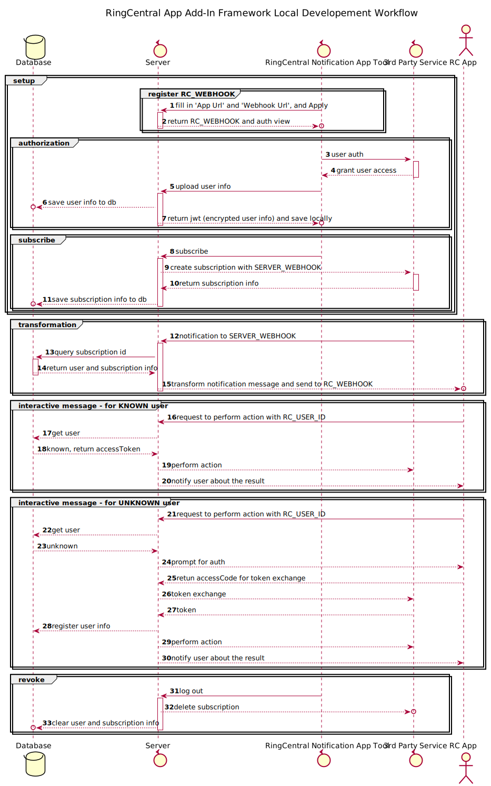

# RingCentral-Add-In-Framework

This template aims to help you quickly set up your app with 3rd party webhook integration.

# Prerequisites

- Download and install RingCentral App and login: https://www.ringcentral.com/apps/rc-app
- Nodejs and npm.

# How It Works

There are 3 major parts involved:
- Setup:
  - Get RingCentral App info
  - Auth on 3rd party and subscribe to events
- Use:
  - Process and forward 3rd party event notifications to RingCentral App via webhook
- Revoke:
  - Unsubscribe and clear user info

# Workflow Diagram

Note: if you don't have Markdown view, please open the flow diagram directly from `diagram/flow.svg`.



# Development

## Step.1 Start Web Tunnel

```bash
# install dependencies
npm i

# create db file - additional note: 'npm run refreshDB' command will clear DB and re-init it
npm run initDB 

# start proxy server, this will allow your local bot server to be accessed by the RingCentral service
npm run ngrok

# will show
Forwarding                    https://xxxx.ngrok.io -> localhost:6066
# Remember the https://xxxx.ngrok.io, we will use it later
```

ngrok will expose your local server to a public address where you can have other services interact with it.

Note: your local firewall might block certain ngrok regions. If so, try changing `ngrok http -region us 6066` in `package.json` to [other regions](https://www.google.com/search?q=ngrok+regions).

## Step.2 Set Up Environment Info

Firstly, create an app on gitlab: https://gitlab.com/-/profile/applications which:
- Give it a name
- Fill Redirect URI with `https://xxxx.ngrok.io/oauth-callack`
- Tick `api` scope
- After it's created, go to the app at the bottom of the page and copy `Application ID` and `Secret`

Rename `sample.env` to `.env` and `sample.env.test` to `env.test`(env for test). There are several OAuth-related fields in `.env` need to be set.

```bash
# .env file

# local server setup
APP_SERVER= # Copy `https://xxxx.ngrok.io` from last step

# Gitlab
API_SERVER= # Your gitlab API server address. Or, the public server is https://github.com
TEST_PROJECT_NAME= # Your gitlab project name. It's hard-coded here for convenience. Please use user input in practices

# 3rd party Oauth
CLIENT_ID= # gitlab app's Application ID here
CLIENT_SECRET= # gitlab app's Secret here
ACCESS_TOKEN_URI= # The public uri is https://gitlab.com/oauth/token
AUTHORIZATION_URI= # The public uri is https://gitlab.com/oauth/authorize
SCOPES= # if SCOPES_SEPARATOR is ',', then SCOPES will be something like scope1,scope2,scope3
SCOPES_SEPARATOR=, # this field is default to ',', but can be changed

# RingCentral developer portal
IM_SHARED_SECRET= # You'll need a RingCentral App first, and this can then be found on developer portal, under App Settings

```

## Step.3 Start Local Server and Client

Open 2 new terminals and run below commands respectively:

```bash
# open a new terminal
# start local server
npm run start

# open another new terminal
# start client app
npm run client
```

### Online Developer Tool

For local development, we can use [RingCentral notification app developer tool](https://ringcentral.github.io/ringcentral-notification-app-developer-tool/) to simulate RingCentral App Gallery shell which handles communications between your app and RingCentral server.

To use above tool, there are two fields we want to fill in:

1. `App Url`: It is for this tool to retrieve the app's entry point to render. In our framework, it's set to `https://xxxx.ngrok.io/setup`
2. `Webhook Url`, there are 2 ways:
   1. Click `Get a webhookUrl` and login to your RingCentral App. Generate webhook url from your Team channel.
   2. Go to RingCentral App Gallery and add `Incoming Webhook` App to your conversation channel. As a result, you will get a webhook URL like `https://hooks.glip.com/webhook/xxxxx` (aka `RC_WEBHOOK`) and that's what we need here.

Now press `Apply` ([workflow 1-2](#workflow-diagram)). We should be able to see the UI button gets rendered in top block.

(Important note: [RingCentral notification app developer tool](https://ringcentral.github.io/ringcentral-notification-app-developer-tool/) doesn't provide the environment for `interactiveMessages`([workflow 16-30](#workflow-diagram)). To have a test environment for that, you will need to [create your sandbox app](#register-app-on-ringcentral-developer-website) on [RingCentral Developer Portal](https://developers.ringcentral.com/login.html#/) (Add-In is currently in beta, so you want to join beta on the same web page).)

## Step.4 Write Your Code and Try It

Now that development environment is all set, let's make some changes to the code. 

There is a few spots that need your input. Note: If you want to test your changes, you'll need to kill the server which runs `npm run start` and start it again.

1. Go to `src/server/routes/authorization.js` and follow the instruction on top. After this step, click `Connect to 3rd Party Service and Subscribe`([workflow 3-7](#workflow-diagram)) and you'll be able to auth user for 3rd party platform. Then Developer Tool should show `Subscribe` and `Unsubscribe and Logout` buttons.
2. Go to `src/server/routes/subscription.js` and follow the instruction on top. After this step, click `subscribe`([workflow 8-11](#workflow-diagram)) button on Developer Tool, your RingCentral App conversation should receive an example message from webhook.
3. Go to `src/server/routes/notification.js` and follow the instruction on top. After this step, it would send message([workflow 12-15](#workflow-diagram)) with data transformed from 3rd party platform notification where there's any new event that you subscribe to.
4. Go back to `src/server/routes/authorization.js`, follow the instruction in `revokeToken` method. After this step, click `Unsubscribe and Logout`([workflow 31-33](#workflow-diagram)) button and there will be no more notifications from 3rd party platform.

Now it should be all set. Please go to RingCentral App Gallery and add your app to a conversation, `Auth` -> `Subscribe` -> `Finish`. It should then provide the ability to listen to `New Issue` event and also give RingCentral user ability to `Close Issue` within RingCentral App.

### Tips

- [Adaptive Cards Designer](https://adaptivecards.io/designer/) is a great online tool to design your Adaptive Cards. Json files under `src/server/adaptiveCards` follow the same format as in `CARD PAYLOAD EDITOR`, so you can design your card on [Adaptive Cards Designer](https://adaptivecards.io/designer/) and copy over the payload directly.
- `npm run refreshDB` to delete existing db file and create a new one

### Additional Note

There are several npm packages to be highlighted here:
- [adaptivecards-templating](https://www.npmjs.com/package/adaptivecards-templating): Tool to inject data into Adaptive Cards json files.
- [sequelize](https://www.npmjs.com/package//sequelize): Node.js database ORM tool
- [axios](https://www.npmjs.com/package/axios): Promise based HTTP client for the browser and node.js
- [client-oauth2](https://www.npmjs.com/package/client-oauth2): OAuth2 wrapper
- [serverless](https://www.npmjs.com/package/serverless): serverless framework

When start development, it's recommended to use 3rd party's official npm package for its API calls.

# Test

This template uses [supertest](https://www.npmjs.com/package/supertest) and [nock](https://www.npmjs.com/package/nock) for testing. A few examples are in `tests` folder. To start test:

```bash
npm run test
```

# Deployment

## Register App on RingCentral Developer Website

Create your app following [this guide](https://developers.ringcentral.com/guide/applications).

## Deploy with Serverless

### 1. Compile JS files

```
$ npm run client-build
```

And get all JS assets file at public folder. Upload all files in public into CDN or static web server.

### 2. Create `serverless-deploy/env.yml` file

```
$ cp serverless-deploy/env.default.yml serverless-deploy/env.yml
```

Edit `serverless-deploy/env.yml` to set environment variables.
We will get `APP_SERVER` after first deploy. So now just keep it blank.

### 3. Create `serverless-deploy/serverless.yml` file

```
$ cp serverless-deploy/serverless.default.yml serverless-deploy/serverless.yml
```

Edit `serverless-deploy/env.yml` to update serverless settings.
The Dynamo `TableName` should be `${DYNAMODB_TABLE_PREFIX}webhooks`. `DYNAMODB_TABLE_PREFIX` is environment variable that we set upper. `ASSETS_PATH` is uri where you host JS files in `Step 1`.

### 4. Deploy

```
$ npm run serverless-build
$ npm run serverless-deploy
```

In first deploy, you will get lambda uri in console output: `https://xxxxxx.execute-api.us-east-1.amazonaws.com/prod`.
Copy the uri, and update environment variable `APP_SERVER` with it in `serverless-deploy/env.yml` file. Then deploy again:

```
$ npm run serverless-deploy
```